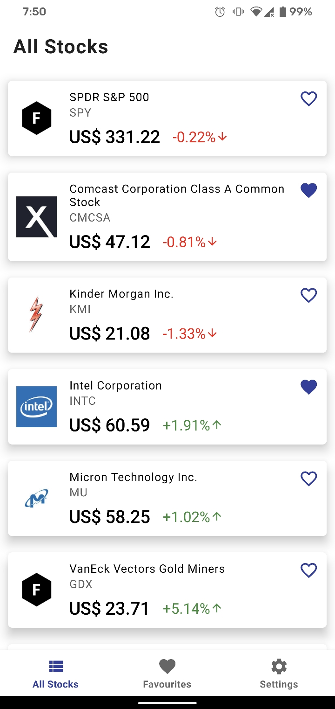
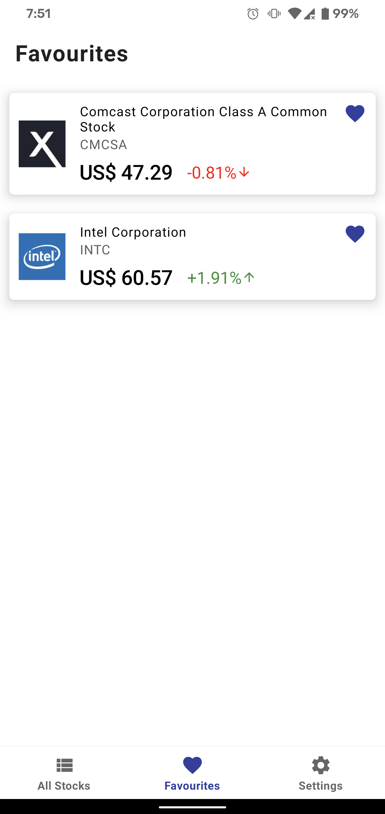
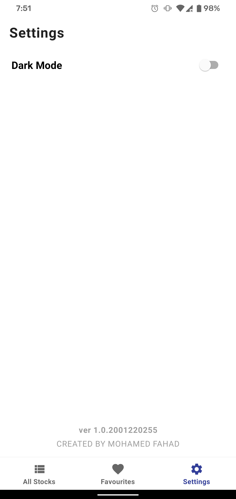
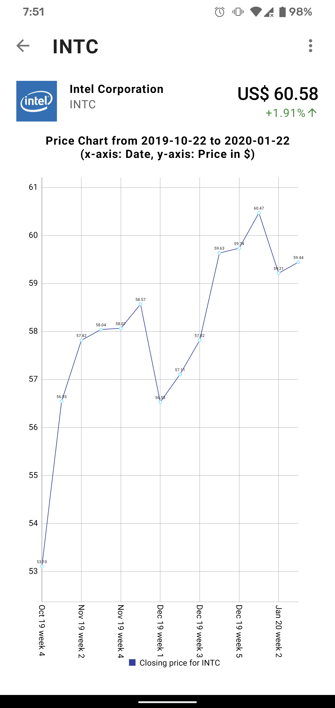
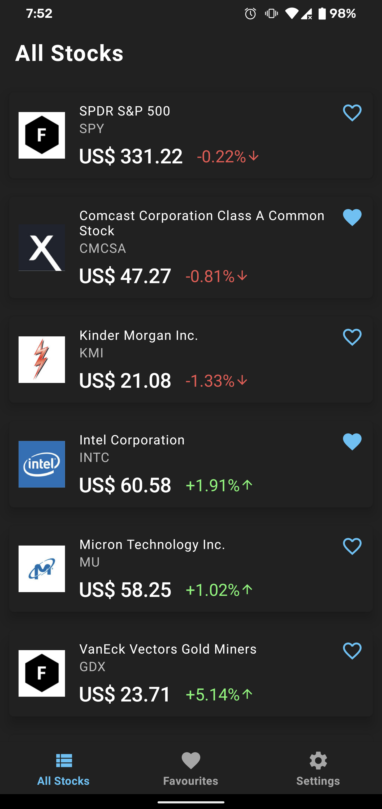
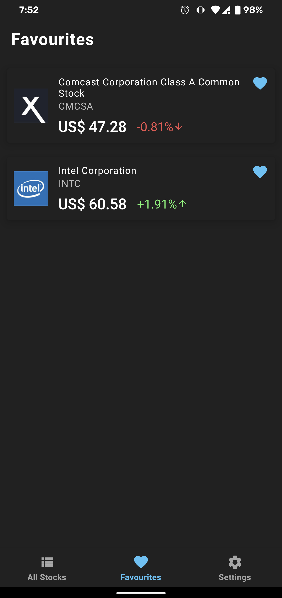
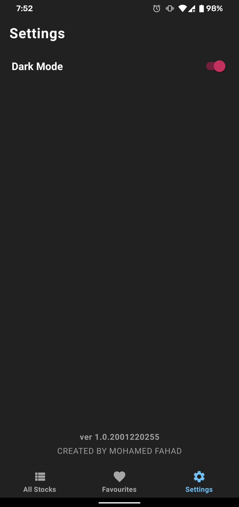
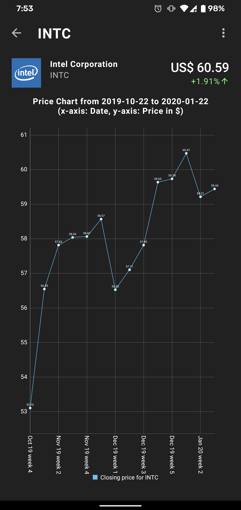

# Zip Challenge

An android app to display a list of stocks and their real time prices. The user can add stocks as favourite and their prices get refreshed every 15 seconds. The app supports Dark Theme and the options to enable/disable is available in Settings. There is also an added feature to view how a company's stock has been performing in the last 3 months, last 6 months, last 1 year, last 3 years.

## Screenshots

### Light Mode

         

### Dark Mode

         

## Architecture

### Design Pattern

`MVVM - Model - ViewModel - View` is the pattern used for this app. MVVM provides a clear separation of concern and has great support in Android SDK in the form of [Architecture Components]#architecture-components.

*Views* - Activities, Fragments, Adapters. Views communicate with ViewModels to perform operations and get the data to be displayed by observing LiveData objects. In this project, I've used a combination of Data binding and populating the views from Classes.

*ViewModels* - Acts as an intermediate between Views and Model. Performs the operation requested by the view and fetches the data from the model.

*Model* - Also called as Repository. Model is the single point of contact to fetch data. Model decides whether the data needs to be fetched from Remote server or Local database.

### Code Structure

The code structure of this app has a design such that every feature has its own package. For example: For Favourites feature, `FavouritesFragment`, `FavouritesViewModel` reside in the same package. The following modules are there in the app:

*app* - Main application module containing the presentation classes for all the features.
*model* - Kotlin library containing all the data classes used in the app.
*shared* - Android library containing Repositories (both remote and local), Room database configuration and data handling logic. This module also has a package called `frameworks` which contains code to accomodate third party libraries such as Glide, MPAndroidChart.

### Architecture Components

The following architecture components have been used in the app:

1. ViewModel - Intermediate between view and model.
2. LiveData - To pass the data to the views. LiveData also has great support with Room database.
3. Room - Local database to store stocks and their profile.
4. Coroutines - To run operations such as network calls, fetching from database in a background thread.

## Functional Specifications

* Stocks will be fetched from *stocks/list* on the first launch of the app and will be refreshed every day at 12:00am. Stocks data is stored in local Room database. Once the data is stored locally, all fetches happen from local database for the entire day.
* Since the company frofile is fetched from *company/profile*, only the first 10 profiles are fetched initially. Once the user starts scrolling, visible stocks' profile is fetched and updated in local database.
* User can add/remove stocks as favourites to monitor for real time price, as shown in Favourites tab.
* An intent service `RefreshRealtimePriceService` is run every 15 seconds to update the price for favourite stocks.
* User can change the theme of the app - Light mode and Dark mode. The selection is stored in `SharedPreferences`. On App launch, the theme of the app is set according to the selected option.
* User can view the details of the stock. 
* Details view also displays a line chart which shows the price comparison of the stock for the last 3 months, last 6 months, last 1 year, last 3 years.

## Libraries used

1. *Material Design Components* - UI widgets like BottomNavigationView, SwitchMaterial and DarkTheme
2. *Retrofit and okHttp* - Network calls
3. *Gson* - Parsing json responses to data classes
4. *Glide* - Image loading
5. *Dagger* - Dependency injection
6. *MPAndroidChart* - Line chart

## Assumptions

* This app will run on devices with minimum SDK version \>= 23
* The default theme of the app is Light mode